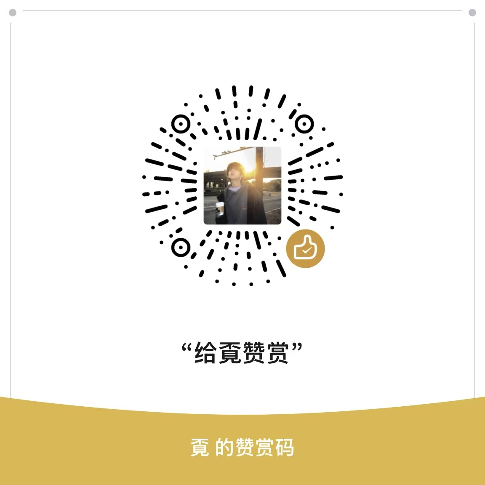

# 视频嗅探器（Video Sniffer）

> 浏览器 MV3 扩展：自动嗅探网页视频，多线程高速下载（aria2 动态分段技术），支持流媒体（HLS/DASH）、MSE 拦截捕获、音视频轨合并与录制。

**版本：4.5.1 ｜ 纯 HTTP 直连，无 P2P / BT / 磁力，完全隐私。**

[English](README.en.md)

---

## 文档

- [CHANGELOG.md](CHANGELOG.md)：版本更新历史
- [SECURITY.md](SECURITY.md)：安全政策与漏洞报告
- [PRIVACY.md](PRIVACY.md)：隐私承诺
- [docs/i18n.md](docs/i18n.md)：国际化说明 · **如何新增一门语言（只需加一个 JSON，无需改代码）**
- [lib/THIRD-PARTY-NOTICES.md](lib/THIRD-PARTY-NOTICES.md)：第三方组件版权与许可证正文 · **借鉴同类项目的边界**
- [lib/VENDOR.md](lib/VENDOR.md)：第三方依赖清单与完整性校验

---

## 功能特性

- **视频嗅探**：自动检测页面直链、HLS/DASH 流、MSE (Media Source Extensions) 捕获、Blob URL，弹出列表一键下载
- **多线程高速下载**：借鉴 aria2 动态分段技术，单文件并发多段，逐段校验长度，失败单段重试（连续 3 次才降级直连），进度实时推送
- **流媒体下载**：HLS 分片（含 AES-128 解密）、DASH 流，自动解析最高画质；TS 流完成下载后自动再封装为标准 MP4（mux.js + mp4-merger），失败自动降级不产出坏文件
- **画质 / 音质自选**：条目上点「画质」即可列出 HLS 主清单 / DASH 清单的可选档位；音视频分离的站点（DASH 双轨）视频轨与音轨可分别选。默认仍是自动取最高，不打开这个菜单就完全走原路径
- **音视频轨合并**：切轨流（视频轨 + 音频轨）自动合并为单 MP4
- **MSE 拦截捕获**：拦截 MediaSource appendBuffer 数据，广告清除、超限截断保护
- **录制模式**：MediaRecorder 实时捕获，支持倍速与黑帧告警
- **列表搜索 / 排序**：条目多时按名称、地址、格式筛选；支持智能排序 / 按大小 / 按名称 / 按类型，排序方式会被记住
- **复制为命令**：一键复制 链接 / `curl` / `aria2c` / `ffmpeg` 命令（自动带上源页面 Referer），方便交给外部下载器
- **粘贴链接下载**：页面没嗅到、或链接在别处时，直接粘贴视频 / 流媒体直链、回车即下载
- **命名模板**：自定义文件名支持 `{title}` `{site}` `{quality}` `{date}` 等变量
- **国际化**：内置中文 / English，跟随浏览器界面语言；**新增语言只需加一个 JSON 文件，无需改代码**（见 [docs/i18n.md](docs/i18n.md)）
- **深色模式**：跟随系统主题；快捷键 `Alt+Shift+V` 直接打开弹窗

---

## 零数据泄露承诺

- 全部下载采用**官方 HTTP(S) 直连**（含 SW 代理与 MSE 捕获），**严禁任何 P2P / BT / 磁力链接**，代码层面硬编码禁止
- 数据仅在你本地浏览器与服务间流动，不上传任何第三方

---

## 安装（开发模式加载）

1. 打开 `chrome://extensions`，右上角开启「开发者模式」
2. 点击「加载已解压的扩展程序」，选择本项目根目录
3. 浏览器版本需 ≥ Chrome 111（Manifest V3）

> 也可以直接下载 [Releases](https://github.com/xhxczggrhz-creator/video-sniffer-extension/releases) 里的 `video-sniffer-<版本>.zip`，解压后按同样方式加载（附带 SHA256 校验和）。

## 使用

1. 打开视频页面，点击扩展图标
2. 列表中会显示嗅探到的视频资源（直链 / 流媒体 / MSE 捕获）
3. 点击「下载」将在下载页多线程下载；流媒体条目自动选择画质并分片下载

---

## 目录结构

```
video-sniffer-extension/
├── background/service-worker.js   # MV3 后台：状态机 / 消息总线 / DNR / 流代理 / 下载调度
├── content/                       # 内容脚本
│   ├── mse-hook.js                #   MSE appendBuffer 拦截 + B站 __playinfo__
│   ├── media-sniffer.js           #   直链/流媒体嗅探 + 录制
│   └── content-script.js          #   消息桥接 / B站 playurl API
├── lib/                           # 核心库（mp4-merger / ts-remux / download-engine / stream-downloader / constants / i18n）
├── download-page/                 # 下载页面（多线程下载引擎 UI / 转封装 / 合并）
├── popup/                         # 扩展弹窗
├── offscreen/                     # Offscreen 文档
├── _locales/                      # 语言包（zh_CN / en；加语言 = 加目录，零代码改动）
├── docs/                          # 国际化等维护文档
├── scripts/                       # 工程脚本（check-js 语法门禁 / i18n-check 语言包门禁 / package 打包+校验和）
├── tests/                         # 回归/单测（test-validate / test-merger / test-ssrf-p03 等）
├── .github/                       # Issue/PR 模板 + CI workflow
└── icons/                         # 图标
```

---

## 开发与测试

```bash
npm install          # 项目无运行时依赖，仅用于启用 npm scripts
npm run lint         # 语法门禁：全部手写 JS（自动区分 ESM/CJS）
npm test             # 单元回归：test-validate + test-merger
npm run test:security   # 安全回归：P0-3 SSRF 字面量绕过防护
npm run test:i18n       # 国际化门禁：语言包与代码引用键一致、占位符一致、片段已合并
npm run package      # 产 dist/video-sniffer-<version>.zip + SHA256
```

---

## 赞赏支持

如果这个项目对你有帮助，欢迎扫下方赞赏码请作者喝杯咖啡。赞赏**纯属自愿**，与任何功能无关，不享受任何付费特权，也不会影响项目的持续开源更新。

<div align="center">

</div>

---

## 免责声明

**在使用本扩展前，请仔细阅读以下条款。安装或使用本扩展即表示你已阅读、理解并同意全部内容。**

### 1. 用途限制

- 本扩展仅供**个人学习、研究与技术交流**使用，仅用于处理**你有权访问与下载**的网络公开媒体资源。
- 禁止用于任何商业用途、非法牟利、盗版传播，或任何违反法律、行政法规及社会公序良俗的行为。

### 2. 版权与合法授权

- 请仅在取得权利人授权或法律明确许可的前提下下载、保存或二次使用内容。
- 是否具备下载权限与合法授权，由**用户自行判断并承担责任**；未经授权下载、复制或传播受版权保护的内容，可能构成侵权。
- 对下载内容进行的转码、封装、二次分发等任何操作，均须遵守《中华人民共和国著作权法》及你所在国家/地区的相关法律。

### 3. 与第三方平台的关系

- 本扩展为独立开发的技术工具，与任何视频平台、内容生产商、软件发行方**无任何隶属、授权、赞助、代理或关联关系**。
- 本扩展**不提供**绕过任何平台付费墙、会员制度（VIP）或数字版权保护（DRM）的破解、解密或绕过能力。
- 若你访问的平台以服务条款禁止自动化下载，请遵守该平台的规范与约定。

### 4. 用户责任

- 使用本扩展的行为及由此产生的全部后果，由**用户本人承担**。
- 作者不对用户滥用本扩展（包括但不限于非法下载、传播、盈利）所导致的任何直接或间接责任、损失或纠纷负责。
- 请确保你的使用行为符合你所在国家/地区的法律法规及平台规则。

### 5. 软件保证与责任限制

- 本扩展按「现状」（AS IS）提供，**不附带任何形式的明示或暗示担保**，包括但不限于适销性、特定用途适用性及不侵权的保证。
- 因使用本扩展（包括下载失败、数据损坏、误用等）造成的任何直接或间接损失，作者概不负责。

### 6. 赞赏与对本项目的关系

- 赞赏**纯属自愿**，属于对作者的支持，**不构成任何形式的交易**，不附带任何功能、服务或特权承诺，也不影响项目的开源与更新。

### 7. 权利保护与下架

- 如本扩展或其中任何内容被认定为侵犯第三方合法权益，**权利人可通过仓库 Issue 与我们联系**，我们将配合处理直至移除相关内容。

---

> 如有疑问，请咨询专业法律人士。最终解释权归本项目作者所有。

---

## License

[MIT](LICENSE)